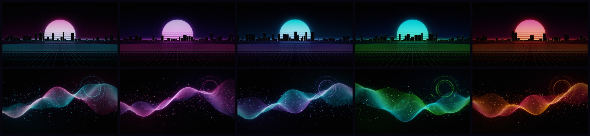

# NEON NEXUS — Windows 11 Theme

A dark neon theme for Windows 11 that installs with one double-click and removes just as cleanly.

Author: Nick Butcher
GitHub: https://github.com/nihkb007/Intune-Repository



---

## What You Get

- **5 accent variants**: Cyan, Magenta, Violet, Toxic, Ember. Each has its own accent color and a matching secondary color.
- **10 wallpapers at 4K (3840×2160)**, in two styles:
  - **Horizon**: a city skyline in front of a striped sun, over a glowing grid floor
  - **Flux**: flowing ribbons of light with particles and circular HUD overlays
- **A custom 8-color accent palette**, written directly to the registry. Windows normally picks these colors itself. This way Start, the taskbar, title bars and window borders get the tuned neon shades.
- **Dark mode** for both apps and Windows itself, with **transparency on**
- **Accent color on Start, the taskbar, title bars and window borders**
- **Slideshow mode**: rotates all 10 wallpapers every 30 minutes in random order
- **Lock screen image**, set through the Windows API. No admin rights needed.
- **Windows Terminal** color scheme ("Neon Nexus") plus a styled PowerShell profile with see-through acrylic and a block cursor. It's added as a *fragment*, so your `settings.json` is never edited.
- **Every variant shows up as a theme** in *Settings → Personalization → Themes*, so you can switch accents with one click.
- **Automatic backup**: your current setup is saved before any change. `Uninstall.cmd` restores it exactly.
- **No admin rights needed.** Everything is installed for the current user only.

---

## Install (Easy Mode)

1. Download or clone this repo.
2. Open `Windows11-Theme\NeonNexus`.
3. Double-click **`Install.cmd`**.
4. Pick an accent and a wallpaper style. Done.

> If Windows SmartScreen or "Mark of the Web" blocks the files, right-click the downloaded ZIP → *Properties* → **Unblock** *before* extracting it.

## Install (Command Line)

```powershell
# Interactive
.\Install.cmd

# Pick everything up front
.\Install.cmd -Accent Toxic -Wallpaper Flux -TaskbarLeft -RestartExplorer

# No prompts
powershell.exe -NoProfile -ExecutionPolicy Bypass -File .\Install-NeonNexus.ps1 -Accent Cyan -Wallpaper Slideshow -Silent
```

| Parameter          | Values                                   | Default   | Description |
|--------------------|------------------------------------------|-----------|-------------|
| `-Accent`          | `Cyan` `Magenta` `Violet` `Toxic` `Ember` | `Cyan`    | Accent color set |
| `-Wallpaper`       | `Horizon` `Flux` `Slideshow`             | `Horizon` | Wallpaper style |
| `-TaskbarLeft`     | switch                                   | off       | Move taskbar icons to the left |
| `-SkipTerminal`    | switch                                   | off       | Don't add the Windows Terminal scheme/profile |
| `-SkipLockScreen`  | switch                                   | off       | Leave the lock screen alone |
| `-RestartExplorer` | switch                                   | off       | Restart Explorer so the taskbar picks up the new color right away |
| `-Silent`          | switch                                   | off       | Skip the banner and prompts |

## Uninstall

Double-click **`Uninstall.cmd`**, or run:

```powershell
.\Uninstall-NeonNexus.ps1 [-KeepFiles] [-RestartExplorer] [-Silent]
```

This restores every registry value from the backup (and removes any value that didn't exist before). It also puts your old wallpaper back and deletes the theme files, the Terminal fragment and the install marker.

---

## Where Things Go

| Item | Location |
|------|----------|
| Theme files + wallpapers | `%LOCALAPPDATA%\Microsoft\Windows\Themes\NeonNexus` |
| Backup + log | `%LOCALAPPDATA%\NeonNexus\backup.json`, `install.log` |
| Terminal fragment | `%LOCALAPPDATA%\Microsoft\Windows Terminal\Fragments\NeonNexus` |
| Install marker | `HKCU\Software\NeonNexus` |

Registry values changed (all backed up first):

- `HKCU\...\Themes\Personalize`: `AppsUseLightTheme`, `SystemUsesLightTheme`, `EnableTransparency`, `ColorPrevalence`
- `HKCU\...\DWM`: `AccentColor`, `AccentColorInactive`, `ColorizationColor`, `ColorizationAfterglow`, `ColorPrevalence`
- `HKCU\...\Explorer\Accent`: `AccentPalette`, `AccentColorMenu`, `StartColorMenu`
- `HKCU\Control Panel\Desktop`: `WallPaper`, `WallpaperStyle`, `TileWallpaper`, `AutoColorization`
- `HKCU\...\Explorer\Advanced`: `TaskbarAl` (only with `-TaskbarLeft`)

---

## Regenerating / Customizing the Wallpapers

The wallpapers are generated by code, so you can re-render them at any resolution or add your own color sets:

```bash
pip install pillow numpy
python Tools/generate_wallpapers.py --width 5120 --height 2880     # 5K
python Tools/generate_wallpapers.py --only toxic                   # one accent
```

Edit the `ACCENTS` table in `Tools/generate_wallpapers.py` (and the matching `$Accents` table in `Install-NeonNexus.ps1`) to add a new color set.

---

## Troubleshooting

| Symptom | Fix |
|---------|-----|
| Taskbar still shows the old color | Re-run with `-RestartExplorer`, or sign out and back in |
| "Running scripts is disabled" | Use `Install.cmd`. It bypasses the execution policy for this one run only |
| Lock screen didn't change | A work/school policy may be locking it, or you launched the installer with PowerShell 7. Use `Install.cmd` |
| Terminal profile missing | Update Windows Terminal (fragments need 1.11+), then restart it |

Built for Windows 11 22H2 and later. Windows 10 mostly works, but the Windows 11 look (rounded corners, Mica) won't apply.

---

## License

MIT, same as the rest of this repository.
