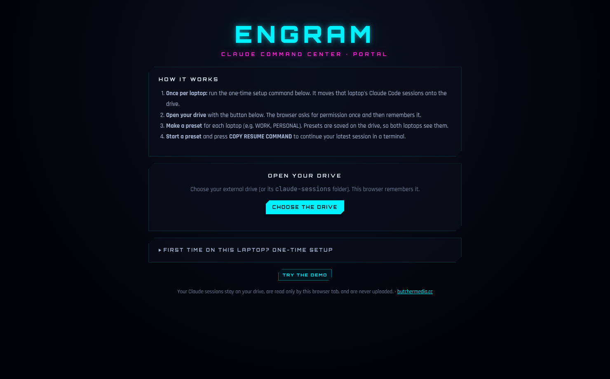
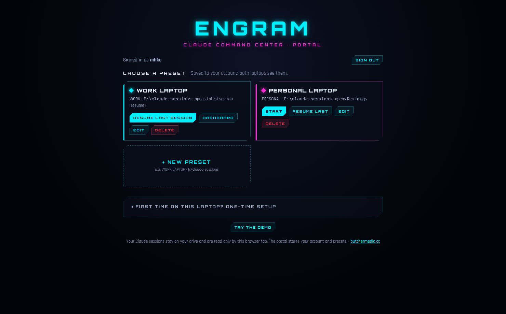
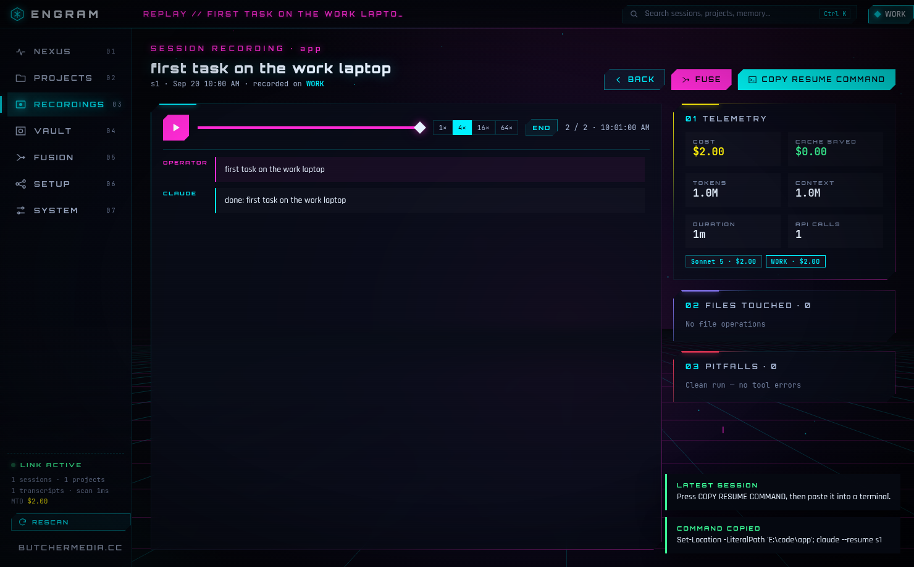

# ENGRAM Web: portal

The ENGRAM command center as a website:
- Claude Code costs, session replays, the notes vault and fusion capsules
- **presets**, one per laptop: which account, what to open first, including **resume my last
  session**

No account and no database needed: your Claude sessions stay on your external drive and are
read only by the browser tab, and presets are saved on the drive
(`claude-sessions\.engram\presets.json`), so both laptops see them. Nothing is uploaded.

| Open the drive | Presets | Resume |
| --- | --- | --- |
|  |  |  |

## Everyday use

1. Open the portal and click **OPEN YOUR DRIVE** (the first time on each laptop, choose
   `E:\` or `E:\claude-sessions`; after that it remembers).
2. Pick a preset (e.g. **WORK LAPTOP**).
3. You land where the preset says. With **Latest session (resume)**, click **COPY RESUME
   COMMAND** and paste it into a terminal: `Set-Location 'E:\your-project'; claude --resume <id>`.

**First time on a laptop:** the portal has a *one-time setup* command. Close Claude Code,
paste it into PowerShell. It moves that laptop's sessions to the drive and links Claude
Code to them (a junction, no admin needed). Running it again is harmless. There's an undo
command under SETUP.

## Optional: an account (needs paid-or-free Redis storage)

Only if you want presets kept on the server instead of the drive. Connect Upstash Redis
storage to the Vercel project and add the environment variable `ENGRAM_ACCOUNT=on`; the site
then opens on a setup page with three steps (it links to the right Vercel pages):

1. **Connect storage:** Vercel → Storage → Create Database → *Upstash for Redis* (free) →
   connect it to the project → redeploy. Your account and presets live there.
2. **Setup code:** copy `ENGRAM_SETUP_CODE` from Vercel → Settings → Environment Variables.
   The deploy job creates it (and never prints it: this repository's logs are public). It
   proves you own the site, so nobody who finds the address first can claim it.
3. **Create your account:** user name, password (12+ characters), setup code.

After that the site asks everyone to sign in. There is exactly one account; the setup page
doesn't come back.

## Deploy to Vercel

The `ENGRAM build` GitHub workflow tests everything, then deploys the portal to Vercel on
every push. It needs one repository secret (*Settings → Secrets and variables → Actions*):

| Secret | Where to find it |
| --- | --- |
| `VERCEL_TOKEN` | Vercel → Account Settings → Tokens |
| `VERCEL_PROJECT_ID` | optional: the workflow already names this repo's project (`prj_1oEZ…`) |
| `VERCEL_ORG_ID` | optional: looked up from the project |

The deploy job sets the project's Root Directory to `engram-web` (with files outside it
included), creates `ENGRAM_SETUP_CODE` if missing, and lets Vercel build and deploy. The
address appears in the run summary.

Advanced: instead of the setup page you can define logins in `ENGRAM_USERS` and
`ENGRAM_SESSION_SECRET` (`npm run make-user -- <name>` prints both); they take precedence.

Security notes:
- Passwords are stored only as PBKDF2 hashes. Sessions are HMAC-signed, HttpOnly, Secure
  cookies (30 days); the signing secret is generated when the account is made.
- Writes require a same-origin header.
- After 8 failed sign-ins or setup-code attempts, an address is locked out for 15 minutes.
- Without an account (or on static hosting) the portal runs open, with presets kept per
  browser.

## How it works

`src/boot.js` shows the connect screen, then loads the **desktop app's own interface and
engine**, unchanged (`../engram/src/renderer`, `../engram/src/core`). Everything
Electron-specific is swapped out:

- `src/engine.js` reads the chosen folder through the File System Access API into an
  in-memory file system (`src/shims/fs.js`), so the engine code runs as-is.
- `src/api.js` provides the same `window.engram` interface the desktop screens call.
- `api/*.js` + `lib/` are the portal server: `me`, `setup`, `login`, `logout`, `presets` (Vercel Node
  functions, no framework). `serve.mjs` runs them locally the same way.
- `src/setup-script.js` generates the PowerShell setup/undo commands. CI runs them on a
  real Windows machine in Windows PowerShell 5.1 and PowerShell 7.

## Develop

```bash
npm ci
npm run build      # -> dist/ (static: index.html, engram-web.js, engram-web.css, fonts, demo-pack.json)
npm run serve      # http://localhost:5173  (ENGRAM_STORE=memory ENGRAM_SETUP_CODE=TEST-CODE-1234 to try the account setup)
npm test           # unit tests (+ real PowerShell tests on Windows)
npm run test:e2e   # builds, then drives Chromium: sign in, presets, resume, a second laptop, sign out, demo
```

`dist/` also works when opened straight from disk (it's one classic script, not ES
modules), except for the demo, which needs http(s).

Built by [butchermedia.cc](https://butchermedia.cc)
