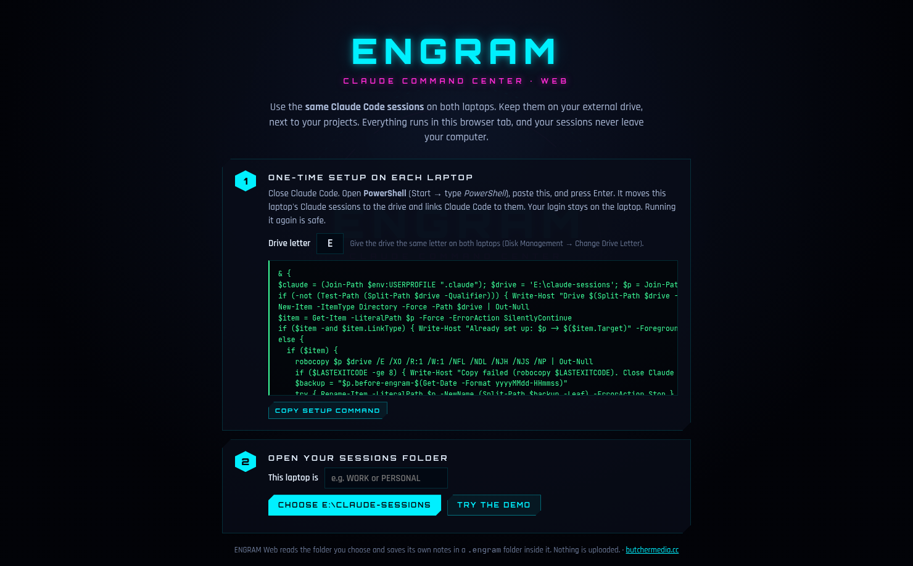

# ENGRAM Web

The ENGRAM command center as a website: Claude Code costs, session replays, the notes
vault and fusion capsules. It works on the Claude Code sessions stored on your external
drive, so **both laptops, with either Claude account, continue the same sessions**. There's
nothing to install, and nothing is uploaded: the page runs entirely in your browser tab.



## Use it

1. **Once per laptop:** give your drive the same letter everywhere (e.g. `E:`), close
   Claude Code, open PowerShell and paste the **setup command** the site shows. It:
   - copies that laptop's existing sessions to `E:\claude-sessions`
   - keeps the original folder as a backup
   - links `%USERPROFILE%\.claude\projects` to the drive with a junction (no admin needed)
   - makes Claude Code keep sessions for 10 years

   Running it twice is harmless. An undo command is on the SETUP page.
2. Open the site in **Edge or Chrome**, name the laptop (e.g. WORK), and choose
   `E:\claude-sessions`. Next time, one click reconnects. Recent Edge and Chrome versions
   remember the permission, so often no click is needed at all.
3. Work as usual: `cd E:\your-project` → `claude --continue`. The site refreshes every 20
   seconds while open.

What gets stored where:

| Where | What |
| --- | --- |
| `E:\claude-sessions\` | Claude Code's own session files (written by Claude Code) |
| `E:\claude-sessions\.engram\engram.json` | ENGRAM's notes, capsules, and which laptop ran which message. It lives on the drive, so both laptops share it. |
| Browser | Only the laptop name and the remembered folder permission |

Costs are split per laptop: each message is credited to the laptop whose browser first
saw it.

The page can't open terminals or folders on its own. Buttons that would, copy the right
command instead (for example `Set-Location … ; claude --resume <id>`). "Inject into
CLAUDE.md" asks you to pick the project folder.

## How it works

`src/boot.js` shows the connect screen, then loads the **desktop app's own interface and
engine**, unchanged (`../engram/src/renderer`, `../engram/src/core`). Everything
Electron-specific is swapped out:

- `src/engine.js` reads the chosen folder through the File System Access API into an
  in-memory file system (`src/shims/fs.js`), so the engine code runs as-is.
- `src/api.js` provides the same `window.engram` interface the desktop screens call.
- `src/setup-script.js` generates the PowerShell setup/undo commands. CI runs them on a
  real Windows machine in Windows PowerShell 5.1 and PowerShell 7.

## Develop

```bash
npm ci
npm run build      # -> dist/ (static: index.html, engram-web.js, engram-web.css, fonts, demo-pack.json)
npm run serve      # http://localhost:5173
npm test           # unit tests (+ real PowerShell tests on Windows)
npm run test:e2e   # builds, then drives Chromium: demo, real folder, two laptops sharing it
```

`dist/` also works when opened straight from disk (it's one classic script, not ES
modules), except for the demo, which needs http(s).

## Hosting

**GitHub Pages:** the `ENGRAM build` workflow builds and tests the site and deploys
`dist/`.
- One-time: *Settings → Pages → Source: GitHub Actions*.
- By default Pages only deploys from the default branch. Merge to `main`, or allow this
  branch under *Settings → Environments → github-pages*.

**Vercel (later):** import the repo, set *Root Directory* to `engram-web`, and keep
*"Include files outside the root directory"* on (the build reads `../engram`).
`vercel.json` already sets the install, build and output settings.

Built by [butchermedia.cc](https://butchermedia.cc)
