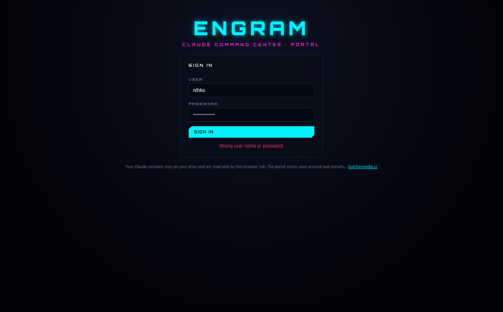

# ENGRAM Web: portal

The ENGRAM command center as a website you sign in to:
- Claude Code costs, session replays, the notes vault and fusion capsules
- **presets**, one per laptop: which drive and folder, which account, what to open first,
  including **resume my last session**

Your Claude sessions stay on your external drive and are read only by the browser tab. The
server stores only your presets.

| Sign in | Presets | Resume |
| --- | --- | --- |
|  |  |  |

## Everyday use

1. Open the portal and sign in.
2. Pick a preset (e.g. **WORK LAPTOP**). The first time on each laptop, point it to
   `E:\claude-sessions` once. After that it remembers.
3. You land where the preset says. With **Latest session (resume)**, click **COPY RESUME
   COMMAND** and paste it into a terminal: `Set-Location 'E:\your-project'; claude --resume <id>`.

**First time on a laptop:** the portal has a *one-time setup* command. Close Claude Code,
paste it into PowerShell. It moves that laptop's sessions to the drive and links Claude
Code to them (a junction, no admin needed). Running it again is harmless. There's an undo
command under SETUP.

## Deploy to Vercel

The `ENGRAM build` GitHub workflow tests everything, then deploys the portal to Vercel on
every push.

1. **Create the project** in Vercel (import this repo, or create an empty project).
2. **Create the login** on any computer with Node:
   ```bash
   cd engram-web && npm ci && npm run make-user -- nihko
   ```
   It asks for a password (12+ characters) and prints `ENGRAM_USERS=…` (a salted hash, not
   the password) and a random `ENGRAM_SESSION_SECRET=…`.
3. **Add GitHub repository secrets** (*Settings → Secrets and variables → Actions*):

   | Secret | Where to find it |
   | --- | --- |
   | `VERCEL_TOKEN` | Vercel → Account Settings → Tokens |
   | `VERCEL_PROJECT_ID` | optional: the workflow already names this repo's project (`prj_1oEZ…`) |
   | `VERCEL_ORG_ID` | optional: looked up from the project |
   | `ENGRAM_USERS`, `ENGRAM_SESSION_SECRET` | output of step 2 (optional here: you can also add them directly in Vercel) |

4. **Presets across laptops:** in Vercel → *Storage*, create an **Upstash Redis** database
   and connect it to the project. It adds `KV_REST_API_URL` and `KV_REST_API_TOKEN`.
   Without it, sign-in still works but presets stay in each browser.
5. Push, or re-run the workflow. The deploy job first sets the project's Root Directory to
   `engram-web` (with files outside it included) and the login variables through the
   Vercel API, then builds and deploys. The deployment URL appears in the run summary.

Security notes:
- Passwords are stored only as PBKDF2 hashes. Sessions are HMAC-signed, HttpOnly, Secure
  cookies (30 days).
- Writes require a same-origin header.
- After 8 failed sign-ins, an address is locked out for 15 minutes.
- Without `ENGRAM_USERS` and `ENGRAM_SESSION_SECRET` the portal runs without login, with
  presets kept per browser. That's the same as the static build.

## How it works

`src/boot.js` shows the connect screen, then loads the **desktop app's own interface and
engine**, unchanged (`../engram/src/renderer`, `../engram/src/core`). Everything
Electron-specific is swapped out:

- `src/engine.js` reads the chosen folder through the File System Access API into an
  in-memory file system (`src/shims/fs.js`), so the engine code runs as-is.
- `src/api.js` provides the same `window.engram` interface the desktop screens call.
- `api/*.js` + `lib/` are the portal server: `me`, `login`, `logout`, `presets` (Vercel Node
  functions, no framework). `serve.mjs` runs them locally the same way.
- `src/setup-script.js` generates the PowerShell setup/undo commands. CI runs them on a
  real Windows machine in Windows PowerShell 5.1 and PowerShell 7.

## Develop

```bash
npm ci
npm run build      # -> dist/ (static: index.html, engram-web.js, engram-web.css, fonts, demo-pack.json)
npm run serve      # http://localhost:5173  (add ENGRAM_USERS, ENGRAM_SESSION_SECRET, ENGRAM_STORE=memory to try the login)
npm test           # unit tests (+ real PowerShell tests on Windows)
npm run test:e2e   # builds, then drives Chromium: sign in, presets, resume, a second laptop, sign out, demo
```

`dist/` also works when opened straight from disk (it's one classic script, not ES
modules), except for the demo, which needs http(s).

Built by [butchermedia.cc](https://butchermedia.cc)
