# ENGRAM: Claude Command Center

> *engram (n.)*: a physical trace of memory in the brain.

ENGRAM is a desktop app for people who run Claude Code. It shows what every project
costs, keeps a permanent archive of your sessions, stores the rules and decisions you
define, and lets you switch between Claude accounts without losing context.

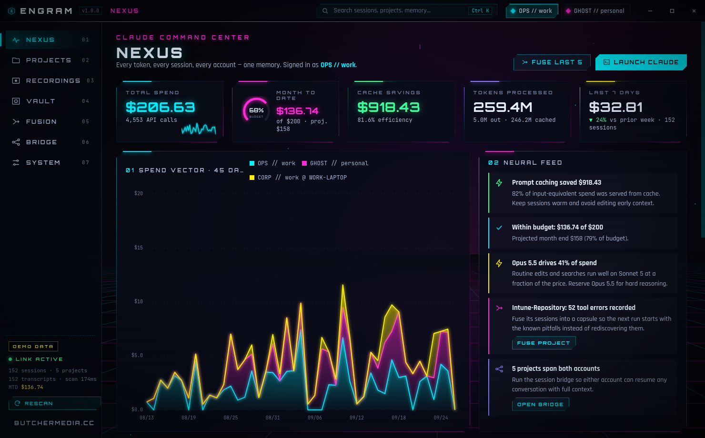

## What it does

| Module | What you get |
| --- | --- |
| **NEXUS** | Total spend, month-to-date spend against your budget, cache savings, tokens, and week-over-week change. Includes a 45-day spend chart split by account, a project burn list, model mix, a weekday × hour activity heatmap, and the **Neural Feed**, which suggests ways to cut cost. |
| **PROJECTS** | Cost, sessions, tokens, errors and files touched for each codebase. The dossier view per project adds charts, a session list and the project's memory. |
| **RECORDINGS** | Every session from every account in one searchable table. ENGRAM archives each transcript, so sessions stay available after Claude Code deletes old history. Sessions can be **replayed** with a play/pause scrubber, speed control, telemetry, files touched and pitfalls hit. |
| **VAULT** | Markdown *directives*, *decisions*, *lessons* and *notes*, each scoped to one project or global. |
| **FUSION** | Pick any sessions, from any account, and combine them into one **context capsule**. A capsule holds your directives, what was asked, where each session ended, the key files, commands that worked and errors already hit. You can copy it, export it, or inject it into the project's `CLAUDE.md`. |
| **BRIDGE** | Multi-account support. You can switch accounts, copy sessions between accounts so `claude --resume <id>` works on either one, sync global directives into every account's `CLAUDE.md`, and open a terminal on any account. |
| **LAPTOP LINK** | Share everything between laptops through any synced folder (OneDrive, Dropbox, Syncthing, a network share). The other laptop's accounts appear alongside yours. The same repo is recognized by its git remote even when it lives at a different path. Vault and capsules merge both ways. You can bring a session from the other laptop and resume it locally. Secrets are masked, and you choose which projects are shared. |
| **SYSTEM** | Budget, an editable pricing table, archive on/off, and effect intensity. |

Press **Ctrl+K** to open the command palette from anywhere.

## How the multi-account memory works

Claude Code keeps a separate folder for each account (`~/.claude`, or whatever
`CLAUDE_CONFIG_DIR` points to). ENGRAM links these folders:

1. **Scan.** ENGRAM reads every account's `projects/**/*.jsonl` transcripts. The same API
   message can appear in more than one file (after a resume, a streaming split or a
   bridged copy). ENGRAM counts each message once.
2. **Session bridge.** ENGRAM copies each transcript into every linked account. When a
   session has diverged, the most complete copy wins. ENGRAM records which account
   produced each message, so costs stay with the account that paid for them.
3. **Memory sync.** Your *global* pinned directives are written into each account's user
   `CLAUDE.md`, inside a managed block:
   `<!-- ENGRAM:BEGIN --> … <!-- ENGRAM:END -->`.
   Anything you wrote outside the block is left as it was.
4. **Project injection.** Fusion capsules go into `<project>/CLAUDE.md`. Claude Code
   loads that file for any account that opens the project.

Whichever account you switch to, Claude starts with the same rules and history.

## Why capsules save tokens

Resuming an old session reloads its full context window. ENGRAM records that size for
each session, shown as **Resume context**. A capsule keeps only what the next session
needs, usually 50 to 400 times smaller. The Fusion view shows the compression ratio and
the dollar amount saved each time you load the capsule instead of the old context.

## Install

**Windows users: follow [docs/WINDOWS.md](docs/WINDOWS.md)** (portable zip or installer,
SmartScreen/Defender notes, linking two Claude accounts).

Downloads are on the repository's **Releases** page (tag `engram-latest`). Or build it
yourself:

```bash
cd engram
npm install
npm run dist:win     # → dist/ENGRAM-Setup-1.0.0.exe + dist/ENGRAM-Portable-1.0.0-win-x64.zip
npm run dist:linux   # → dist/ENGRAM-1.0.0-x86_64.AppImage + .deb
npm run dist:mac     # → dist/ENGRAM-1.0.0.dmg          (run on macOS)
```

The Windows installer is a guided NSIS wizard with custom ENGRAM artwork. It lets you
choose the install folder, and creates Start Menu and desktop shortcuts and an
uninstaller. Uninstalling keeps your vault. To build the Windows installer on Linux,
you need Wine with 32-bit support (`wine32:i386`).

## Develop

```bash
npm start            # run against your real Claude accounts
npm run demo         # run against generated demo data (two accounts, ~140 sessions)
npm test             # unit tests (node:test)
npm run test:e2e     # launches the real app, walks every view, writes docs/screenshots
npm run icons        # re-render icon + installer artwork
```

To run the end-to-end suite against a packaged build:
`ENGRAM_EXE=dist/linux-unpacked/engram npm run test:e2e`.

### Layout

```
src/core/       parsing, pricing, scanning, fusion, bridge, store  (pure Node, unit tested)
src/main/       Electron main process + preload (contextIsolation, sandboxed renderer)
src/renderer/   UI: app shell, views, hand-built SVG charts, animated backdrop
scripts/        demo-data generator, icon/installer artwork renderer
test/unit/      engine tests      test/e2e/   Playwright-driven Electron run
```

## Privacy

ENGRAM runs entirely on your machine and makes no network calls. It reads Claude Code
transcripts from your local config folders, and stores its vault at
`%APPDATA%/ENGRAM/vault` (Windows), `~/Library/Application Support/ENGRAM/vault` (macOS)
or `~/.config/ENGRAM/vault` (Linux). It writes into your Claude folders only when you
ask it to (bridge sync, memory sync, capsule injection).

## Screenshots

All screenshots use generated demo data.

| | |
| --- | --- |
| 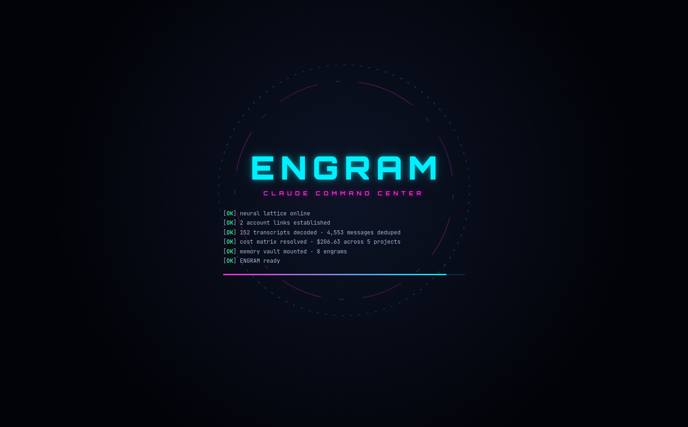 | 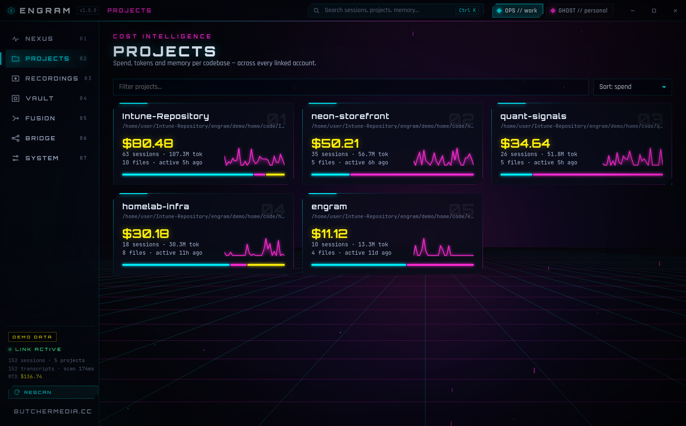 |
| 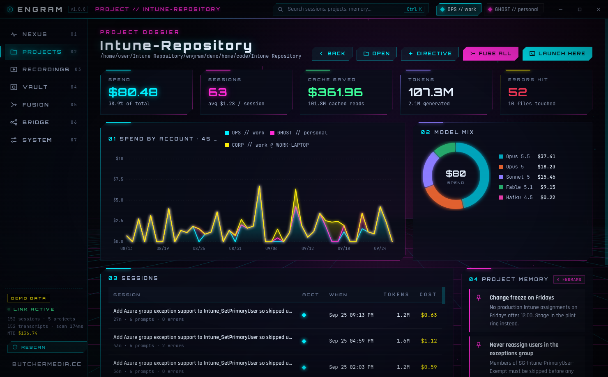 | 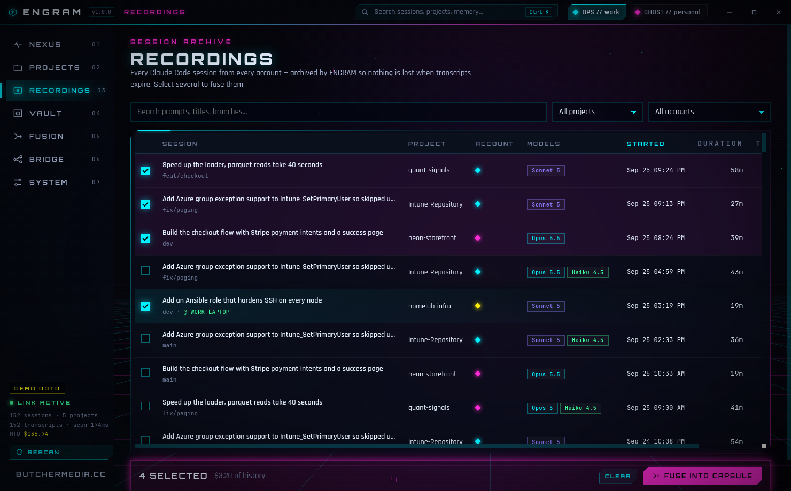 |
| 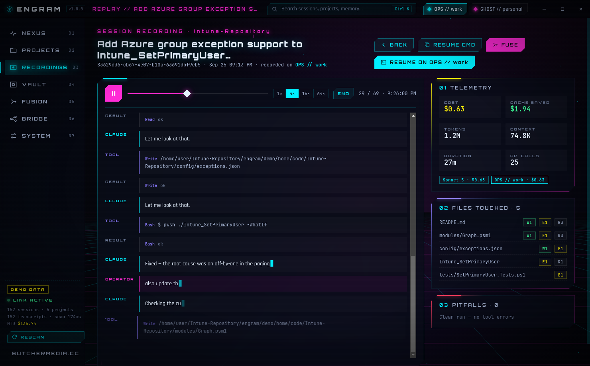 | 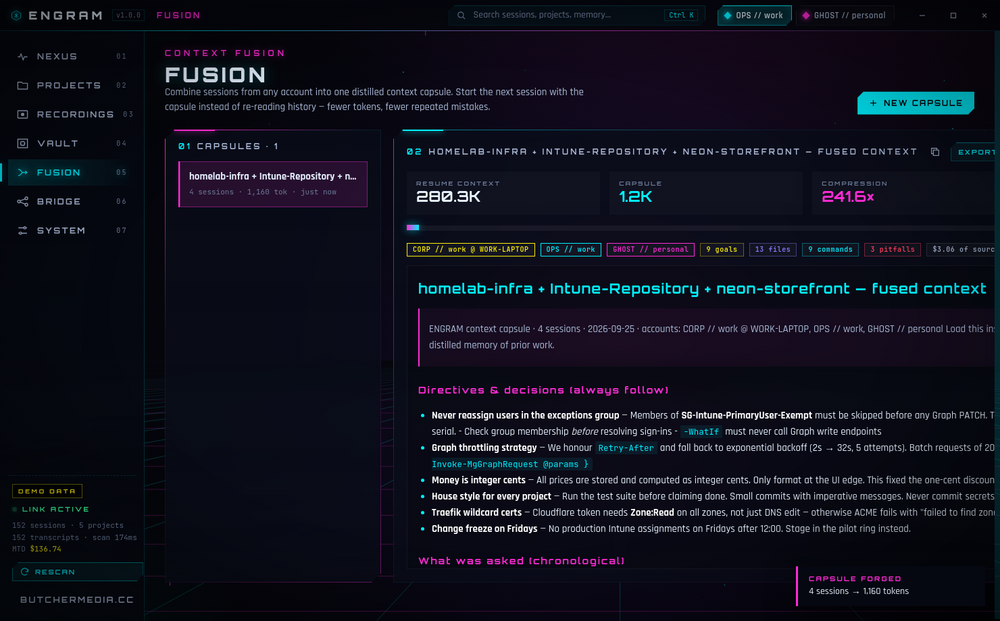 |
| 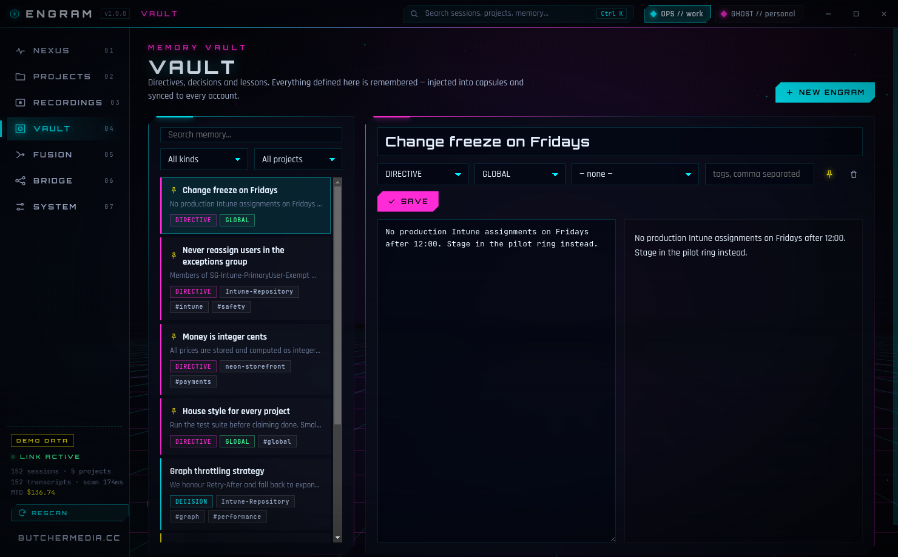 | 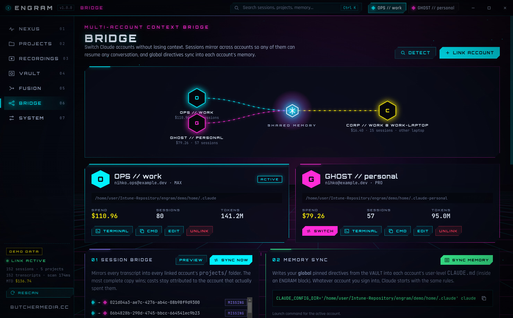 |
| 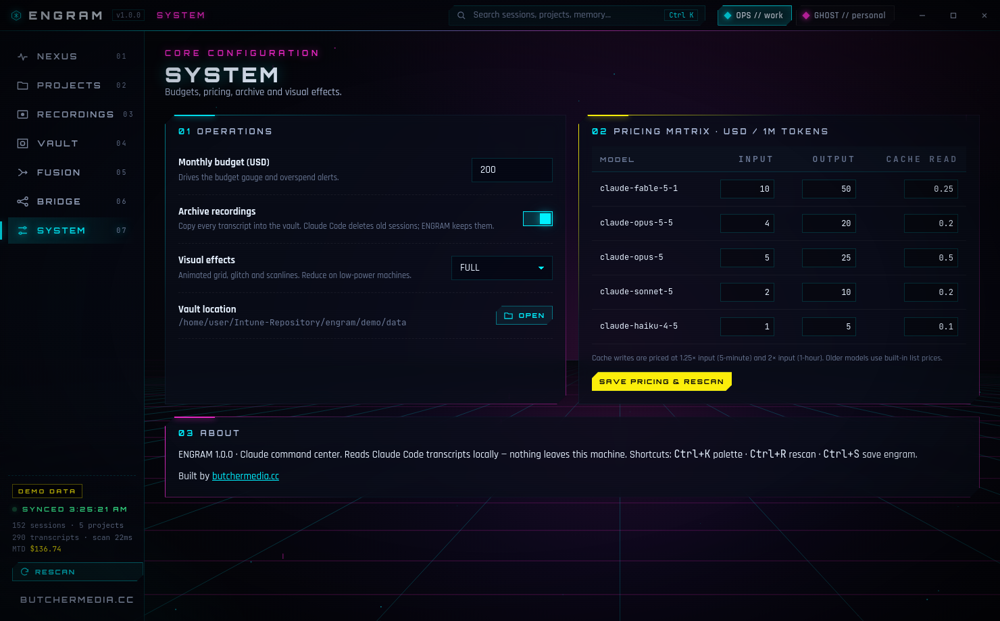 | 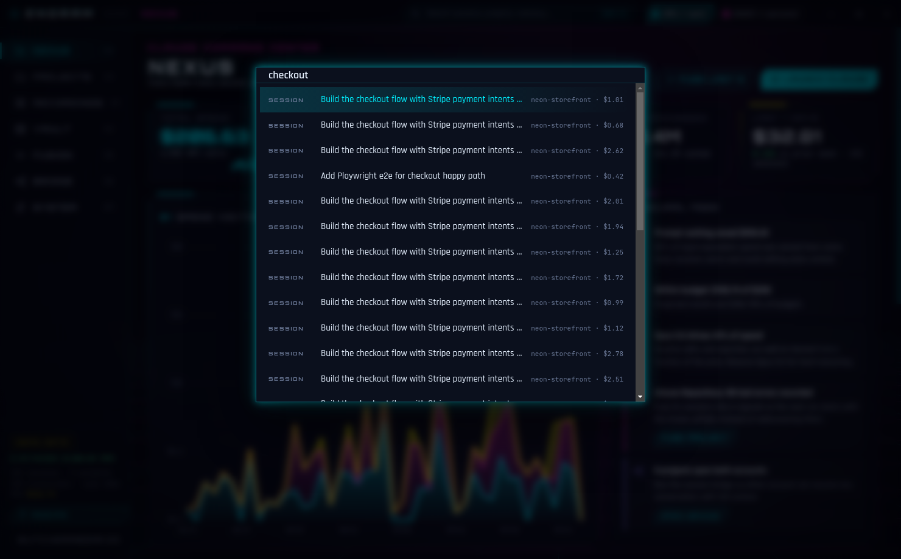 |
| 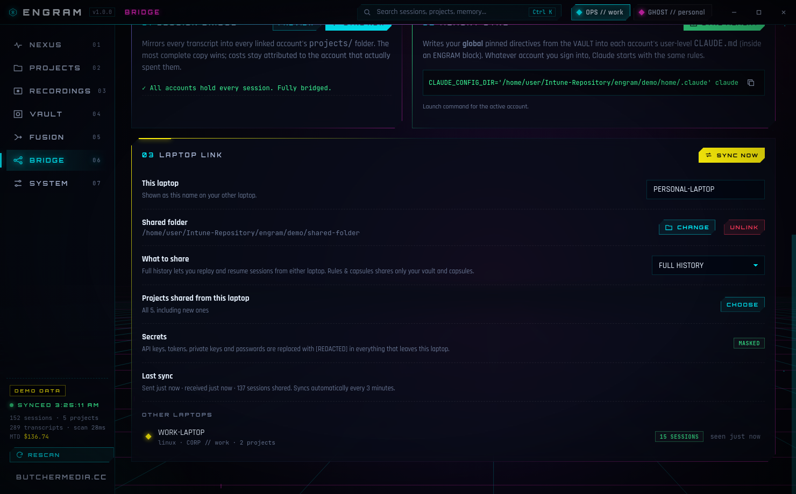 | 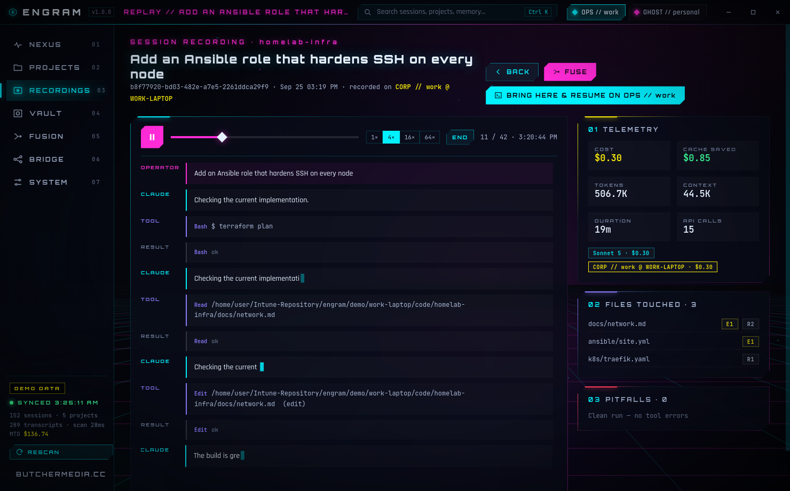 |

---

Built by [butchermedia.cc](https://butchermedia.cc)
